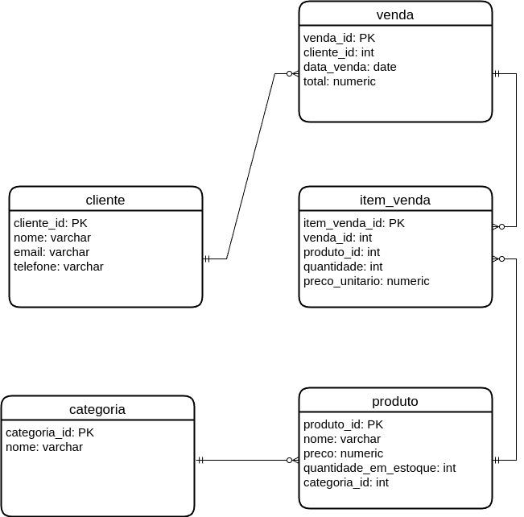

# Configuração do PostgreSQL com Docker

### Criando uma aplicação terminal para gerenciamento e execução de *queries* de um banco de dados em PostgreSQL isolado em ambiente Docker.

## 1. PostgreSQL [](https://github.com/postgres/postgres)

PostgreSQL, frequentemente abreviado como Postgres, é um banco de dados relacional de código aberto e altamente avançado. Ele foi desenvolvido pela primeira vez em 1986 como parte do projeto POSTGRES na Universidade da Califórnia, em Berkeley, e foi lançado oficialmente ao público em 1996.

Aqui estão alguns pontos-chave sobre o PostgreSQL:

1. Código Aberto: PostgreSQL é distribuído sob a licença PostgreSQL, uma licença de código aberto permissiva que permite a utilização, modificação e distribuição do software gratuitamente;

2. Conformidade com ACID: PostgreSQL é conhecido por sua conformidade com ACID (Atomicidade, Consistência, Isolamento e Durabilidade), garantindo transações seguras e confiáveis;

3. Suporte a SQL Avançado: Ele suporta uma ampla gama de tipos de dados e funcionalidades SQL, incluindo subconsultas, junções complexas, índices, triggers, visões, e muito mais;

4. Extensibilidade: PostgreSQL é altamente extensível. Usuários podem definir novos tipos de dados, operadores, funções, agregados e métodos de índice. Isso permite personalizações específicas para diferentes aplicações;

5. Suporte a JSON e HSTORE: Além dos dados relacionais tradicionais, PostgreSQL oferece suporte robusto para armazenar e consultar dados JSON e hstore, o que facilita o trabalho com dados semiestruturados;

6. Replicação e Recuperação: PostgreSQL suporta replicação de streaming, replicação lógica e várias opções de backup e recuperação, o que o torna adequado para aplicações de alta disponibilidade e recuperação de desastres;

7. Comunidade Ativa e Extensiva Documentação: Há uma comunidade ativa de desenvolvedores e usuários que contribuem para o desenvolvimento contínuo do PostgreSQL. A documentação oficial é abrangente e bem mantida;

8. Compatibilidade com Diversas Plataformas: PostgreSQL é compatível com diversos sistemas operacionais, incluindo Linux, Windows e macOS.

## 2. Docker [](https://github.com/docker)

Docker é uma plataforma de código aberto que automatiza a implantação de aplicações dentro de contêineres de software, proporcionando um ambiente consistente para desenvolvimento, teste e produção. Lançado em 2013, Docker revolucionou a forma como as aplicações são desenvolvidas e executadas, simplificando a criação, distribuição e execução de aplicativos em qualquer ambiente.

Principais características do Docker:

1. Contêineres: Docker utiliza contêineres para empacotar uma aplicação e todas as suas dependências em uma única unidade executável. Isso garante que a aplicação funcione de maneira idêntica, independentemente do ambiente em que é executada;

2. Imagens Docker: Uma imagem Docker é um pacote leve, standalone e executável que inclui tudo o que é necessário para rodar um pedaço de software, incluindo código, runtime, bibliotecas e configurações. As imagens podem ser compartilhadas por meio do Docker Hub ou repositórios privados;

3. Docker Hub: Um serviço de registro público de Docker que permite aos usuários encontrar e compartilhar contêineres. Ele possui uma vasta biblioteca de imagens oficiais de diversos softwares, como sistemas operacionais, bancos de dados e ferramentas de desenvolvimento;

4. Portabilidade: Os contêineres Docker podem ser executados em qualquer lugar, desde o laptop de um desenvolvedor até servidores em produção, e até mesmo na nuvem. Isso facilita a movimentação de aplicações entre diferentes ambientes sem ajustes adicionais;

5. Isolamento: Cada contêiner Docker é isolado, com seu próprio sistema de arquivos, rede e espaço de processo, o que aumenta a segurança e evita conflitos entre aplicações;

6. Eficiência: Os contêineres são mais leves e eficientes em termos de recursos do que máquinas virtuais, permitindo maior densidade de aplicações no mesmo hardware;

7. Orquestração: Ferramentas como Docker Compose e Kubernetes facilitam a definição e a gestão de aplicações multi-contêiner, permitindo escalar aplicações horizontalmente e gerenciar seus ciclos de vida de forma eficaz.

## Tutorial para Configuração do Ambiente no Ubuntu

### 1. Verifique se o Docker já está instalado

Para isso, abra o terminal ou aperte **Ctrl + Alt + Del** e digite os seguintes comandos:

```bash
docker --version
sudo systemctl status docker
```

Se o Docker estiver instalado, aparecerá algo como: 

```console
Docker version 20.10.7, build f0df350

● docker.service - Docker Application Container Engine
   Loaded: loaded (/lib/systemd/system/docker.service; enabled; vendor preset: enabled)
   Active: active (running) since Mon 2021-07-05 09:42:15 UTC; 1h 23min ago
     Docs: https://docs.docker.com

```

Caso aparecer saídas semelhantes a estas, vá para o Passo 3.

### 2. Instalando o Docker

Antes de instalar o Docker, é uma boa prática garantir que seus pacotes do sistema estejam atualizados. Execute os seguintes comandos:

```bash
sudo apt-get update
sudo apt-get upgrade
```

Em seguida, instale as dependências para permitir que o sistema use repositórios HTTPS:

```bash
sudo apt-get install apt-transport-https ca-certificates curl software-properties-common
```
Adicione a chave GPG oficial do repositório do Docker ao sistema:

```bash
curl -fsSL https://download.docker.com/linux/ubuntu/gpg | sudo apt-key add -
```

Adicione o repositório do Docker às fontes de pacotes APT:

```bash
sudo add-apt-repository "deb [arch=amd64] https://download.docker.com/linux/ubuntu $(lsb_release -cs) stable"
```

Depois de adicionar o repositório do Docker, atualize novamente a lista de pacotes:

```bash
sudo apt-get update
```

Agora, é possível instalar a versão mais recente do Docker Community Edition (CE) usando o seguinte comando:

```bash
sudo apt-get install docker-ce
```

Depois que a instalação estiver concluída, é possível verificar se o Docker foi instalado corretamente executando o comando abaixo:

```bash
sudo systemctl status docker
```

**Importante:** depois de instalar o Docker, é necessário adicionar seu usuário ao grupo "docker" para executar comandos Docker sem precisar usar `sudo` toda vez. Você pode fazer isso com o seguinte comando:

```bash
sudo usermod -aG docker $USER
```

### 3. Instalando o PostgreSQL

Use os seguitnes comandos para baixar as imagens do PostgreSQL e pgAdmin do DockerHub:

```bash
docker pull postgres
docker pull dpage/pgadmin4
```

Em seguida, crie uma rede Docker para que os contêineres possam se comunicar. Execute o seguinte comando:

```bash
docker network create pg-network
```

Agora, será criado o contêiner do PostgreSQL. Certifique-se de definir a senha do banco de dados e vincular o contêiner à rede que acabamos de criar. Execute o seguinte comando:

```bash
docker run -d --name postgres-container -e POSTGRES_PASSWORD=sua_senha -p 5432:5432 --network pg-network postgres
```
Substitua `sua_senha` pela senha desejada para o PostgreSQL. Agora, será criado o contêiner do pgAdmin. Este contêiner ajudará a gerenciar o PostgreSQL. Execute o seguinte comando:

```bash
docker run -d --name pgadmin-container -p 80:80 --network pg-network -e 'PGADMIN_DEFAULT_EMAIL=seu_email' -e 'PGADMIN_DEFAULT_PASSWORD=sua_senha' dpage/pgadmin4
```

Substitua `seu_email` pelo seu endereço de e-mail e `sua_senha` pela senha desejada para o pgAdmin. Agora, é possível acessar o pgAdmin no navegador usando `localhost:80`. Faça login com o e-mail e senha definidos anteriormente. No pgAdmin, vá para Servers -> Add New Server. Na guia Connection, em Host name/address, insira `postgres-container`, que é o nome do contêiner do PostgreSQL que foi criado anteriormente. Use `postgres` como nome de usuário e a senha que você definiu.

### 4. Criando e Populando o Banco de Dados

Aqui, será criado o banco de dados populado a partir dos arquivos `create_tables_pdv.sql` e `populate_tables_pdv.sql`, representado pela figura a seguir. 

<p align="center">
  
</p>


Para isso, use o comando docker cp para copiar os arquivos SQL para o contêiner do PostgreSQL (certifique-se que você está no diretório onde os scripts estão localizados):

```bash
docker cp create_tables_pdv.sql postgres-container:/create_tables_pdv.sql
docker cp populate_tables_pdv.sql postgres-container:/populate_tables_pdv.sql
```

Em seguida, acesse o contêiner do PostgreSQL e execute os scripts SQL:
```bash
docker exec -it postgres-container bash
psql -U postgres -f /create_tables_pdv.sql
psql -U postgres -f /populate_tables_pdv.sql
exit
```

Depois de executar os scripts, verifique se as tabelas foram criadas e populadas corretamente acessando o pgAdmin e visualizando o banco de dados PDV:

- **Acesse o pgAdmin:** abra o navegador e acesse http://localhost:80. Faça login com o e-mail e senha que você configurou anteriormente;

- **Conecte-se ao servidor PostgreSQL:** adicione um novo servidor se ainda não tiver feito isso, conectando-se ao `postgres-container`;

- **Verifique as tabelas e dados:** expanda o banco de dados PDV e navegue até Schemas -> public -> Tables. Você deve ver as tabelas categoria, produto, cliente, venda e item_venda. Clique com o botão direito sobre uma tabela e selecione View/Edit Data -> All Rows para ver os dados inseridos.